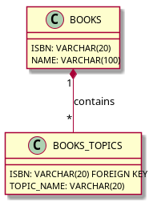

# Example of `toTableMapping`

Given a DynamoDB table called `MY_BOOKS` that contains the following objects:

```
{
  "isbn": {
    "S": "1763413749"
  },
  "name": {
    "S": "Accessing NoSQL-Databases in Exasol using Virtual Schemas"
  },
  "topics": {
    "L": [
      {
        "S": "DynamoDB"
      },
      {
        "S": "Exasol"
      },
    ]
  }
}
```

The primary key for the DynamoDB table is `isbn`.

We want to map this DynamoDB table to the following relational structure: 



Note that `BOOKS_TOPICS` uses `ISBN` as FOREIGN KEY.

To achieve this we create the following mapping definition:

```
{
  "$schema": "https://raw.githubusercontent.com/exasol/dynamodb-virtual-schema/master/src/main/resources/mappingLanguageSchema.json",
  "srcTable": "MY_BOOKS",
  "destTable": "BOOKS",
  "description": "Maps MY_BOOKS to BOOKS",
  "mapping": {
    "fields": {
      "isbn": {
        "toVarcharMapping": {
          "varcharColumnSize": 20,
          "overflowBehaviour": "ABORT",
          "key": "global"
        }
      },
      "name": {
        "toVarcharMapping": {
          "varcharColumnSize": 100,
          "overflowBehaviour": "TRUNCATE"
        }
      },
      "topics": {
        "toTableMapping": {
          "mapping": {
            "toVarcharMapping": {
              "destinationName": "NAME"
            }
          }
        }
      }
    }
  }
}
```

The Virtual Schema adapter automatically adds a foreign key to the table. In the example above, it adds
 the column `BOOKS_ISBN` to the `BOOKS_TOPICS` table. It did pick the `ISBN` column, because we marked 
 it as a key column.
 
