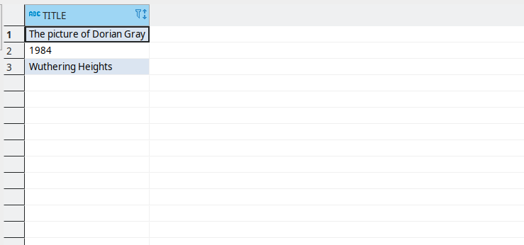

# Hands-on DynamoDB Virtual Schema

In this Hands-on guide, we will explore the new [Virtual Schema for Amazon DynamoDB](https://github.com/exasol/dynamodb-virtual-schema).

We will create a mapping from DynamoDB's semi-structured documents to a relational Exasol table.

Exasol's Virtual Schemas allow you to access external data just like regular tables using SQL. The existing Virtual Schemas all use a JDBC connector for accessing the external data. The Virtual Schema for DynamoDB is the first of a new category of Virtual Schemas, the Virtual Schemas for document data. These new Virtual Schemas directly use the native API of the external data source. By that, we can parallelize the data loading and create a much better performance.

## Amazon DynamoDB

[Amazon DynamoDB](https://aws.amazon.com/dynamodb/) is a fully managed document database, offered by AWS. You can use it, for example, as a database backend for an online bookshop. Like all document databases, it uses a document data model. If you now think of PDF documents or doc files, you will be surprised, when you see the DynamoDB data. In this context document data refers to documents like JSON documents.

For example:

 ```json
{
  "Name": "The picture of Dorian Gray",
  "Author": {
    "FirstName": "Oscar",
    "LastName": "Wilde"
  }
}
```

Unlike relational databases like Exasol, document-databases do not enforce a schema for the data. Instead, each document stored in a document database could have different properties.

For accessing the data from Exasol we have to extract a schema and map it to a relational table model. We will do so later in this tutorial.

## DynamoDB Setup

To try out the new DynamoDB Virtual Schema we need a DynamoDB. Although DynamoDB is only offered as a cloud service, Amazon also provides a local version for local testing.

So you have the choice which variant you want to use to follow this tutorial:

* DynamoDB on AWS
    * free in [AWS Free Tier](https://aws.amazon.com/de/free/) (credit card required)
* [Local test DynamoDB](https://docs.aws.amazon.com/amazondynamodb/latest/developerguide/DynamoDBLocal.DownloadingAndRunning.html)
    * free
    * for testing only

### DynamoDB on AWS

If you decided to use DynamoDB on AWS, let us show you how to set it up.

1. Get an AWS Account ([AWS Free Tier](https://aws.amazon.com/de/free/))
1. [Install AWS CLI](https://docs.aws.amazon.com/cli/latest/userguide/install-cliv2.html)
1. [Create an access key](https://docs.aws.amazon.com/IAM/latest/UserGuide/id_credentials_access-keys.html#Using_CreateAccessKey)  for your AWS account
1. create `~/.aws/credentials` and fill in:
    ```
    [default]
        aws_access_key_id = <YOUR_ACCESS_KEY>
        aws_secret_access_key = <YOUR_SECRET_ACCESS_KEY>
        region = aws-region
    ```
   *Don't forget to replace `<YOUR_ACCESS_KEY>` and `<YOUR_SECRET_ACCESS_KEY>` by you keys from the previous steps.*

1. Verify the setup by typing:
    ```shell
    aws help
    ```

### Local DynamoDB

Amazon offers a local version of DynamoDB for testing purposes. You can run the local DynamoDB using plain Java, Maven or as a docker container (see [AWS documentation](https://docs.aws.amazon.com/amazondynamodb/latest/developerguide/DynamoDBLocal.DownloadingAndRunning.html)). In this guide, we will use the docker version. You can however also use a different method.

Steps for setup:

1. Install DynamoDB:
    ```shell
    docker run -p 8000:8000 amazon/dynamodb-local -jar DynamoDBLocal.jar -sharedDb -dbPath .
    ```
1. [Install AWS CLI](https://docs.aws.amazon.com/cli/latest/userguide/install-cliv2.html)
1. create `~/.aws/credentials` and fill in:
   ```
   [default]
       aws_access_key_id = fakeMyKeyId
       aws_secret_access_key = fakeSecretAccessKey
       region = eu-central-1
   ```
   *The local DynamoDB does not check credentials. So we just need to add something for passing the checks in the CLI.*

In the following steps, you have to append `aws help --endpoint-url http://localhost:8000` to all `aws dynamodb` commands.

## Setup sample data

Now we are going to load some example data into the DynamoDB. For that we first of all need to create a DynamoDB table. We will do that using the AWS CLI. For DynamoDB on AWS there is also a GUI.

You can create the table by simply running the following command in a shell.

```shell
aws dynamodb create-table \
    --table-name Books \
    --attribute-definitions \
        AttributeName=Title,AttributeType=S \
    --key-schema \
        AttributeName=Title,KeyType=HASH \
    --provisioned-throughput \
        ReadCapacityUnits=1,WriteCapacityUnits=1
```

You can verify that the table was created by running:

```shell
aws dynamodb list-tables
```

The output should contain the `Books` table, we just created.

### Load example data

For testing the data access we will also need some example data. For that reason, we created an example data set that contains information about three books. DynamoDB, unfortunately, can't directly load regular JSON data. Instead, you have to use a special JSON structure, that contains the DynamoDB data types. We did already create the example data file in this DynamoDB specific format so that you can simply load it.

Steps:

1. [Download example data](./exampleData.json)
2. Load the data into DynamoDB by running:

```shell
aws dynamodb batch-write-item --request-items file://./exampleData.json
```

## Setup an Exasol database

Now we need an Exasol database. In this guide, we will use a local Exasol VM. You can however also use the [Exasol docker-db](https://github.com/exasol/docker-db) or the [SAAS edition](https://docs.exasol.com/saas/home.htm) of Exasol database.

Independent of which setup you choose it is important that the Exasol database can reach the DynamoDB over the network. Hence you can not use an Exasol DB running in the cloud in combination with a local DynamoDB (ok, it would be possible if you can open a port on your firewall, but probably you don't want to do so).

## Install the Virtual Schema Adapter

So now we are going to install the dynamodb-virtual-schema adapter. The adapter is the software that translates between DynamoDB and Exasol.

Steps:

1. [Download latest adapter release (.jar)](https://github.com/exasol/dynamodb-virtual-schema/releases/)
1. [Create a Bucket in BucketFS](https://docs.exasol.com/administration/on-premise/bucketfs/create_new_bucket_in_bucketfs_service.htm)
1. Upload the adapter to the BucketFS:
    ```shell
   curl -I -X PUT -T document-virtual-schema-dist-9.4.2-dynamodb-3.1.3.jar http://w:writepw@<YOUR_DB_IP>:2580/default/
   ```
1. Create a schema to hold the adapter script:
    ```sql
   CREATE SCHEMA ADAPTER;
   ```
1. Create the Adapter Script:
    ```sql
    CREATE OR REPLACE JAVA ADAPTER SCRIPT ADAPTER.DYNAMODB_ADAPTER AS
       %scriptclass com.exasol.adapter.RequestDispatcher;
       %jar /buckets/bfsdefault/default/document-virtual-schema-dist-9.4.2-dynamodb-3.1.3.jar;
    /
    ```
1. Create UDF:
    ```sql
    CREATE OR REPLACE JAVA SET SCRIPT ADAPTER.IMPORT_FROM_DYNAMO_DB(
      DATA_LOADER VARCHAR(2000000),
      SCHEMA_MAPPING_REQUEST VARCHAR(2000000),
      CONNECTION_NAME VARCHAR(500))
      EMITS(...) AS
        %scriptclass com.exasol.adapter.document.UdfEntryPoint;
        %jar /buckets/bfsdefault/default/document-virtual-schema-dist-9.4.2-dynamodb-3.1.3.jar;
    /
   ```

## Create a Mapping Definition

Now we need to tell the adapter how to map the DynamoDB documents to Exasol tables. For that, we create a file with the [Exasol Document Mapping Language (EDML)](https://github.com/exasol/virtual-schema-common-document/blob/master/doc/user_guide/edml_user_guide.md).

You can create the file wherever you want. We will later upload it to the BucketFS.

`firstMapping.json`:

```json
{
  "$schema": "https://schemas.exasol.com/edml-1.5.0.json",
  "source": "Books",
  "destinationTable": "BOOKS",
  "description": "Mapping for the Books table",
  "mapping": {
    "fields": {
      "Title": {
        "toVarcharMapping": {
          "varcharColumnSize": 254
        }
      }
    }
  }
}
```

Now upload the mapping to BucketFS:

```shell
curl -I -X PUT -T firstMapping.json http://w:writepw@<YOUR_DB_IP>:2580/default/mappings/firstMapping.json
```

Now you have created your first mapping definition. This one is very simple. We will cover more complex mappings in an upcoming article. If you don't want to wait until then you can also check out the [EDML documentation](https://github.com/exasol/virtual-schema-common-document/blob/master/doc/user_guide/edml_user_guide.md) on your own.

By the way, the EDML is universal over all document Virtual Schemas. So in the future, you can use the same language for defining mappings for DynamoDB, MongoDB, or JSON files.

## Create Virtual Schema

Now we can create the Virtual Schema.

Steps:

1. Create a connection to DynamoDB
    * For DynamoDB on AWS use:
       ```sql
      CREATE CONNECTION DYNAMO_CONNECTION
         TO 'aws:<REGION>'
         USER '<AWS_ACCESS_KEY_ID>'
         IDENTIFIED BY '<AWS_SECRET_ACCESS_KEY>';
      ```
    * For a local DynamoDB use:
       ```sql
      CREATE CONNECTION DYNAMO_CONNECTION
          TO 'http://<YOUR_DYNAMODB_IP>:8000'
          USER 'fakeMyKeyId'
          IDENTIFIED BY 'fakeSecretAccessKey';
      ```

2. Create Virtual Schema:
    ```sql
   CREATE VIRTUAL SCHEMA DYNAMODB_TEST USING ADAPTER.DYNAMODB_ADAPTER WITH
       CONNECTION_NAME = 'DYNAMO_CONNECTION'
       MAPPING         = '/bfsdefault/default/mappings/firstMapping.json';
   ```

## First Results

Now you can browse the newly created table `DYNAMODB_TEST.BOOKS`:



You can see that the adapter mapped the title property of the documents to a column in the Exasol table.

## Next Steps

In the next part of this series, we will show how to create more complex mappings.
