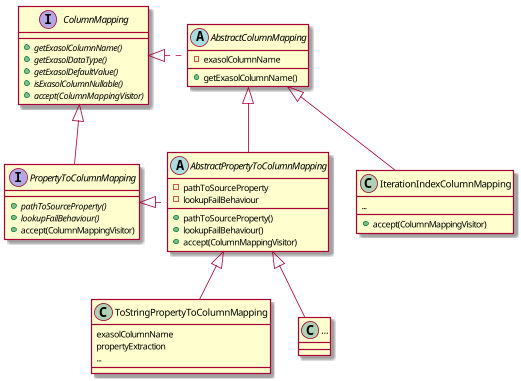
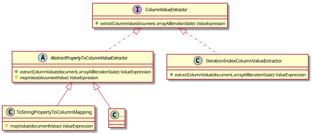
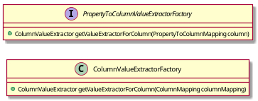

# Schema Mapping Software Architecture

The `JsonMappingFactory` reads the schema mapping from a [schema mapping file](https://exasol.github.io/dynamodb-virtual-schema/schema_doc/index.html) 
. It builds a mapping representation using the following class structure:

The following classes implement the `ColumnMapping` and `PropertyToColumnMapping` interfaces:  

This structure is used:
* By the `SchemaMappingToSchemaMetadataConverter` for generating `SchemaMetadata` that is send to Exasol at `CREATE VIRTUAL SCHEMA` or `REFRESH`. 
* For Mapping the remote attribute values to Exasol values according to this definition.
* For building the remote query

## Mapping Remote Attributes

The `ColumnValueExtractor` extracts the value of a column from a document. 
As the extraction depends on the type of the column, 
there is an hierarchy of `ColumnValueExtractor` analog to the column hierarchy. 

The `ColumnValueExtractor`s are built by a `ColumnValueExtractorFactory`. This factory uses an implementation of `PropertyToColumnValueExtractorFactory` to build the 
specific factory implementation for a remote database.

