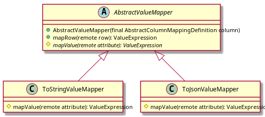
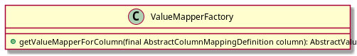

# Schema mapping software architecture

The schema mapping is read from a [schema mapping file](https://exasol.github.io/dynamodb-virtual-schema/schema_doc/index.html) by the `JsonMappingFactory`. 
It builds a mapping representation using the following class structure:

This structure is used:
* By the `SchemaMappingDefinitionToSchemaMetadataConverter` for generating `SchemaMetadata` that is send to Exasol at `CREATE VIRTUAL SCHEMA` or `REFRESH`. 
* For Mapping the remote attribute values to Exasol values according to this definition.

## Mapping the remote attribute
Remote values are mapped to Exasols `ValueExpression`s using a `ValueMapper`:

A `ValueMapper` corresponding to a specific `AbstractColumnMappingDefinition` is built using a `ValueMapperFactory`:

